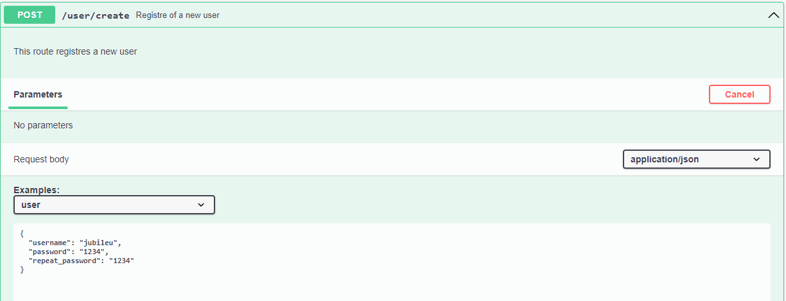
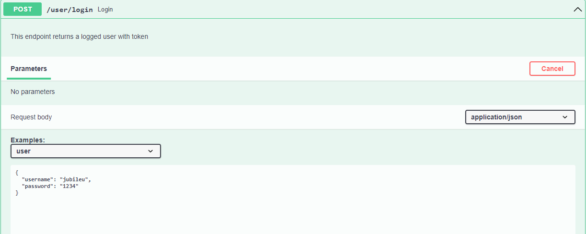
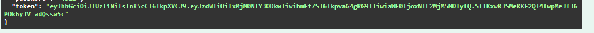

## Description

That's a simple solution to start APIs in nodejs if you don't want to download all dependencies every time when you start some new project.

You can implement any architecture on this template and it already comes with prettier, jest, eslint, docker and suport for circleci if you wanna implement CI/CD in that platform.

## Basics

The template comes by default with some basic commands, for example:

### To build project and add husky configuration

(to know more about husky: https://typicode.github.io/husky/#/)

```
$ yarn build
```

### Or if you wanna just create .husky folder with pre-push and pre-commit files

```
$ yarn prepare
```

### To start project from dist folder

```
$ yarn start
```

### To start project from src folder with nodemon

(to know more about nodemon: https://nodemon.io/)

```
$ yarn dev
```

### Run all the test suits

```
$ yarn test
```

### Select wich suit you wanna run in watch mode or related files uncommited by git

(know more in: https://jestjs.io/docs/cli)

```
$ yarn test:watch
```

### Run all the tests and generate bunch of informations about project test coverage

```
$ yarn test:coverage
```

### To start project from docker container

(know more in: https://docs.docker.com/get-started/ and https://docs.docker.com/compose/gettingstarted/)

```
$ docker-compose up
```

### To migrate database schemas

(know more in: https://prisma.io/docs/concepts/components/prisma-migrate)

```
$ npx prisma migrate dev
```

## Project folders schema

```
sword-health-test
├─ .circleci
│  └─ config.yml
├─ .editorconfig
├─ .eslintignore
├─ .eslintrc.json
│  ├─ index
│  ├─ info
│  │  └─ exclude
│  ├─ lint-staged_unstaged.patch
│  ├─ logs
│  │  ├─ HEAD
│  │  └─ refs
│  │     ├─ heads
│  │     │  └─ main
│  │     └─ remotes
│  │        └─ origin
│  │           ├─ HEAD
│  │           └─ main
├─ .gitignore
├─ .prettierrc.json
├─ Dockerfile
├─ README.md
├─ assets
│  ├─ authorization field.png
│  ├─ authorize botton.png
│  ├─ create_user.PNG
│  ├─ login.PNG
│  └─ token-login.PNG
├─ bin
│  └─ wait-for-it.sh
├─ docker-compose.yml
├─ jest.config.js
├─ nodemon.json
├─ package.json
├─ prisma
│  ├─ migrations
│  │  ├─ 20230403235856_create_databases
│  │  │  └─ migration.sql
│  │  ├─ 20230404001632_add_user_role
│  │  │  └─ migration.sql
│  │  ├─ 20230404020235_add_relation
│  │  │  └─ migration.sql
│  │  ├─ 20230404021336_add_index
│  │  │  └─ migration.sql
│  │  ├─ 20230404163650_add_title
│  │  │  └─ migration.sql
│  │  ├─ 20230404174610_add_task_status
│  │  │  └─ migration.sql
│  │  └─ migration_lock.toml
│  └─ schema.prisma
├─ src
│  ├─ config
│  │  ├─ client
│  │  │  └─ client.ts
│  │  ├─ environment-consts.ts
│  │  └─ swagger.json
│  ├─ controllers
│  │  ├─ handlers
│  │  │  └─ handles.ts
│  │  ├─ task-controller.ts
│  │  └─ user-controller.ts
│  ├─ domains
│  │  ├─ errors
│  │  │  └─ error.ts
│  │  ├─ interfaces
│  │  │  └─ interfaces.ts
│  │  ├─ task-domain.ts
│  │  └─ user-domain.ts
│  ├─ factories
│  │  ├─ controller-factories.ts
│  │  ├─ infra-factories.ts
│  │  └─ middlewares-factory.ts
│  ├─ index.ts
│  ├─ infra
│  │  ├─ encryotion
│  │  │  └─ encryption.ts
│  │  ├─ errors
│  │  │  └─ errors.ts
│  │  ├─ message-broker
│  │  │  └─ message-broker-server.ts
│  │  └─ repositories
│  │     ├─ interfaces
│  │     │  └─ repository-interfaces.ts
│  │     ├─ task-repository.ts
│  │     └─ user-repository.ts
│  ├─ middlewares
│  │  └─ authentication-middlewares.ts
│  ├─ routes.ts
│  └─ services
│     ├─ interfaces
│     │  └─ interfaces.ts
│     ├─ task-service.ts
│     └─ user-service.ts
├─ tests
│  ├─ config
│  │  └─ client.ts
│  ├─ controller
│  │  └─ user-controller.int.spec.ts
│  ├─ infra
│  │  ├─ encryption
│  │  │  └─ encryption.spec.ts
│  │  └─ repositories
│  │     ├─ task-repository.spec.ts
│  │     └─ users-repository.spec.ts
│  ├─ mocks
│  │  └─ mocks.ts
│  └─ services
│     ├─ task-service.spec.ts
│     └─ user-service.spec.ts
├─ tsconfig-build.json
├─ tsconfig.json
├─ yarn-error.log
└─ yarn.lock

```

## Basic usage

If you wanna tests endpoints you have get the authentication token. To get token may start application and access the address YOUR_LOCALHOST:ENV_FILE_PORT/api. After see swagger home page, access users tags and create an new user.



Then, make login with your username and password



Logged, copy the user token provided via http response



Now, go to the authorization botton at the top of swagger home page.


And paste your authorization token into blank field, then click in authoriza


Now you're authenticated and you can test all application endpoints.
